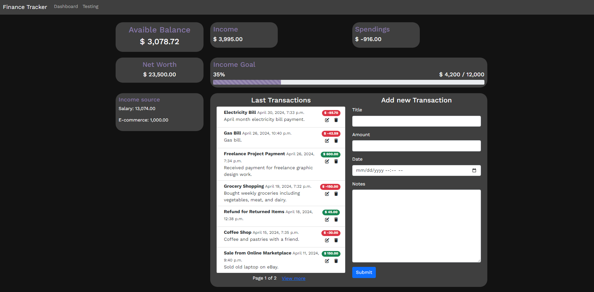

# Finance Tracker in Python Django

This finance tracker is a web application built with Django 5.0.4 and Python 3.10, leveraging HTML, CSS, and Bootstrap 5 for a responsive user interface. It uses SQLite for data management. The application will offer features including multi-account management for checking, savings, and investments with support for multiple currencies. It will provide budgeting tools that allow users to set and monitor budgets for various categories, complete with visual graphs and alerts for spending limits. Users will also track expenses with customizable categories, set and monitor saving goals with visual progress indicators, and manage investment portfolios across various assets, offering insights and growth visualizations compared to market benchmarks. 

This all-in-one finance solution is ideal for personal finance management and goal setting.

# For development notes:
Color palette: https://colorffy.com/dark-theme-generator (Primary #382bf0, Dark color #121212)

Current state of the app:

## Last update 26.04.2024
